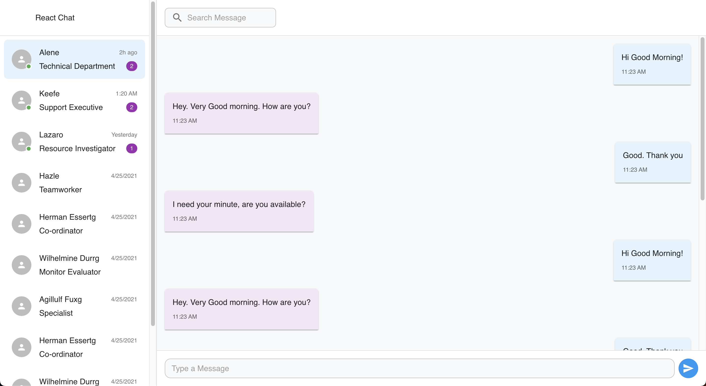

# Project React Chat

It's a chat/messaging interface using Material UI v7 in JSX format. The interface shows a conversation between team members with a contact list on the left and chat messages on the right.

# Setup

-- AceBase (to persist messages) in a docker container hosted on Google Cloud

-- Socket.IO (for real-time send/receive)

-- React as client interface

# Create Vite Project

npm create vite@latest
npm install

# Run

npm run dev

# Install Packages

npm i -S @mui/material @emotion/react @emotion/styled

npm i -S @fontsource/roboto

npm i -S @mui/icons-material

npm i -S @mui/x-data-grid @mui/x-date-pickers dayjs

npm i -S axios socket.io-client

npm i -S react-router-dom

# Install Dev Packages

npm i -D gh-pages

npm i -D copyfiles

npm i -D prettier

npm i -D eslint-config-prettier

# CI and DC

- run: npm ci
- run: npm run prettierfix    
- run: npm run predeploy
- run: npm run deploy

# View Interface

  

| Description | Link |
|-------------|------|
| Online view | https://devrazec.github.io/chat/ |

# Overview of the implementation

-- User Login Route: Validate email/password, generate JWT.

-- Protected Routes: Use JWT middleware to allow access only with valid token, middleware verifies token on protected routes.

-- Token Expiration: Control session timeout.

-- Logout: Use token blacklisting.

-- Store active or blacklisted tokens in the database (/sessions node in AceBase).

-- Check tokens against the blacklist in middleware.

-- Delete (or blacklist) tokens on logout.

# Only one session per user

-- On login: Before creating a new session, find and invalidate any existing session for that user.

-- On logout: Mark the session as inactive.

-- Middleware: Only accept tokens from sessions that are marked active.